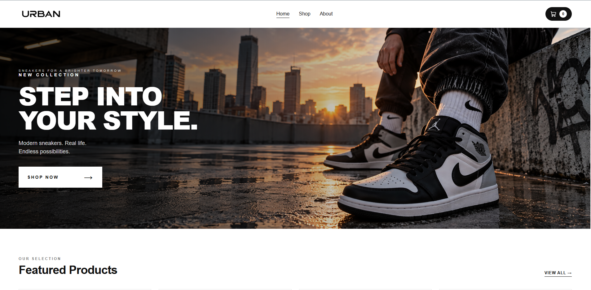
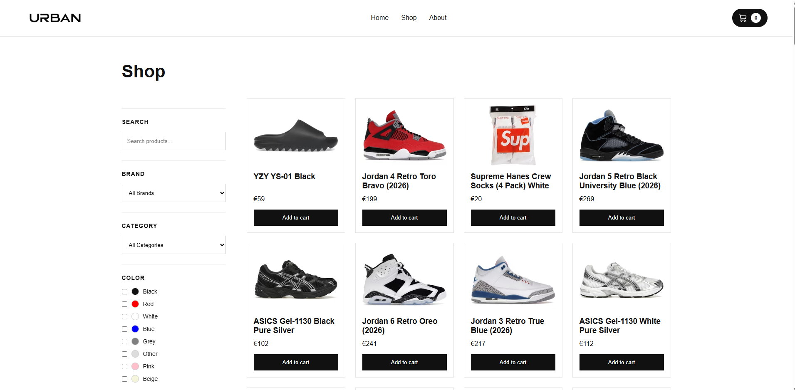
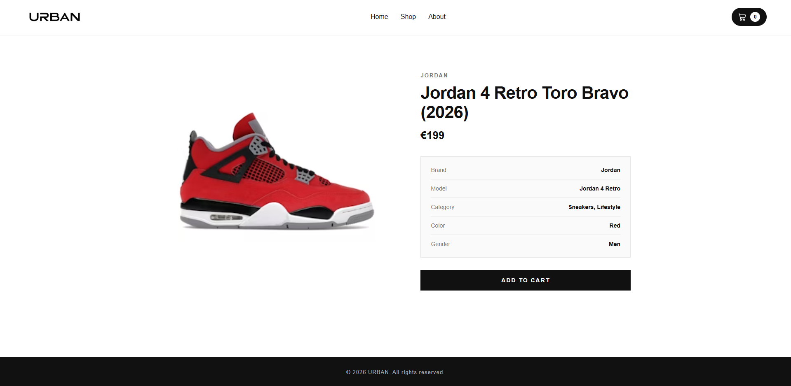
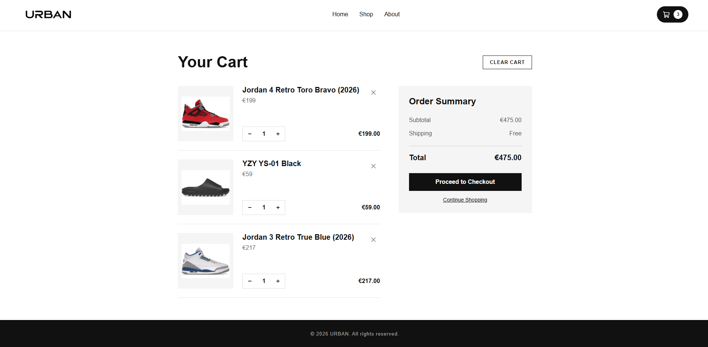
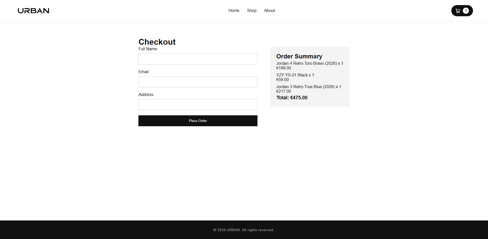

# URBAN — Sneaker E-Commerce Store

URBAN is a modern sneaker and streetwear e-commerce frontend built with React.

**[View Live Demo](https://urban-sneaker-store.vercel.app/)**

The project focuses on creating a clean and responsive shopping experience, featuring real sneaker product data, dynamic filtering, product pages, cart functionality, and a complete checkout flow.

## Features

- Sneaker products fetched from an external API
- Product search
- Filter by brand, category, color, and gender
- Multi-select color filtering
- Price sorting
- Reset filters
- Dynamic product detail pages
- Shopping cart
- Increase and decrease product quantities
- Remove products from cart
- Cart persistence with localStorage
- Checkout flow
- Checkout route protection for empty carts
- Order confirmation page
- Responsive design
- Loading and error states
- Custom 404 page

## Tech Stack

- React
- JavaScript
- React Router
- Vite
- CSS
- Lucide React
- KicksDB API

## What I Learned

While building URBAN, I practiced and improved my understanding of:

- React component architecture and reusable components
- Props and lifting state
- React state management with `useState`
- Side effects with `useEffect`
- Client-side routing with React Router
- Dynamic routes and URL parameters
- Fetching and normalizing API data
- Loading and error handling
- Array methods such as `map`, `filter`, `find`, `reduce`, `some`, and `flatMap`
- Building dynamic filters from API data
- Controlled form inputs and checkboxes
- Persisting application state with localStorage
- Responsive layouts with CSS Grid, Flexbox, and media queries
- Environment variables with Vite
- Basic accessibility practices

## Running Locally

Clone the repository:

```bash
git clone YOUR_REPOSITORY_URL
```

Install dependencies:

```bash
npm install
```

Create a `.env` file in the project root:

```env
VITE_KICKS_API_KEY=your_api_key
```

Start the development server:

```bash
npm run dev
```

## API

Product data is provided by the KicksDB API.

The API key is stored in an environment variable and the `.env` file is excluded from version control.

> Note: Because this is a frontend-only Vite application, variables prefixed with `VITE_` are included in the client bundle. A production application should proxy requests through a backend or serverless function when an API credential must remain private.

## Screenshots

### Home


### Shop


### Product Details


### Cart


### Checkout



## About the Project

URBAN is a fictional brand created as a portfolio project for practicing modern frontend development and building a complete e-commerce user experience.

This project does not process real payments or orders.